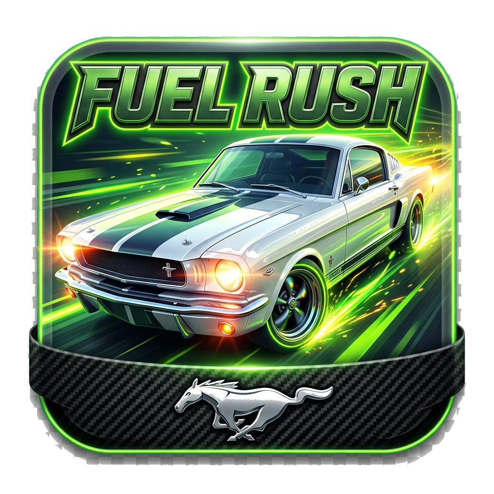
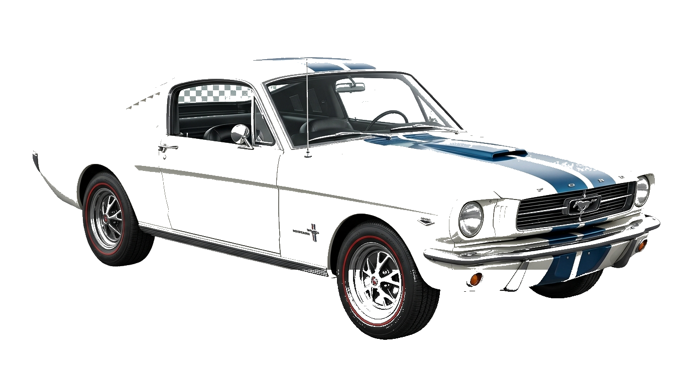
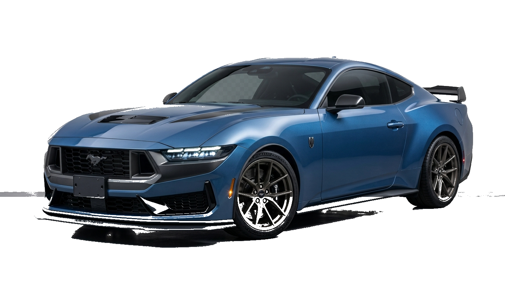

<div align="center">
  
  <h1 style="font-family: 'Montserrat', sans-serif; color: #00E5FF; font-size: 38px; margin-top: 10px;">Fuel Rush: Mustang Simulator Apex</h1>
  <p style="font-family: 'Montserrat', sans-serif; color: #94A3B8; font-size: 18px;"><b>High-Performance .NET 10 MAUI Cross-Platform 2D Engine with AI Co-Pilot Telemetry &amp; Physics Simulation</b></p>

  <p>
    <a href="https://dotnet.microsoft.com/en-us/apps/maui"></a>
    <a href="https://github.com/praveshbalaji/FuelRushMaui/actions"></a>
    <a href="https://github.com/praveshbalaji/FuelRushMaui/releases"></a>
    <a href="LICENSE"></a>
  </p>
</div>

---

<div align="center" style="background: linear-gradient(135deg, #0a0e17 0%, #113979 100%); padding: 30px; border-radius: 16px; margin: 25px 0;">
  <h2 style="color: #FFD700; font-family: 'Montserrat', sans-serif; margin-top: 0; font-size: 26px;">📲 Download Production APK (`FuelRushMaui.apk`)</h2>
  <p style="color: #E2E8F0; font-size: 16px; max-width: 650px; margin: 0 auto 20px auto;">
    Play <b>Fuel Rush</b> directly on your Android phone or Windows PC! Download the latest signed release built automatically via GitHub Actions CI/CD:
  </p>
  
  <p>
    <a href="https://github.com/praveshbalaji/FuelRushMaui/releases/latest/download/FuelRushMaui.apk" style="background-color: #22C55E; color: #FFFFFF; font-family: 'Montserrat', sans-serif; font-weight: bold; font-size: 20px; padding: 16px 36px; text-decoration: none; border-radius: 12px; display: inline-block; box-shadow: 0 4px 14px rgba(34, 197, 94, 0.4);">
      ⚡ DOWNLOAD FUELRUSHMAUI.APK (SIGNED RELEASE)
    </a>
  </p>
  <p style="color: #94A3B8; font-size: 14px; margin-top: 12px;">
    Alternative direct link: <a href="https://github.com/praveshbalaji/FuelRushMaui/releases/latest/download/fuelrush.apk" style="color: #38BDF8; font-weight: bold;">fuelrush.apk</a> | <a href="https://github.com/praveshbalaji/FuelRushMaui/releases" style="color: #38BDF8;">View All GitHub Releases &amp; Assets</a>
  </p>
</div>

---

## 📌 Executive Overview & Core Engineering Highlights

**Fuel Rush: Mustang Simulator Apex** is an enterprise-grade, high-framerate cross-platform 2D racing simulator built with modern **.NET 10 MAUI**, custom **`Microsoft.Maui.Graphics` IDrawable 60 FPS Canvas rendering**, an **AI Co-Pilot Telemetry Engine (Dynamic Difficulty Adjustment)**, and custom **Assembly Embedded Resource Streaming**.

Designed as a technical showcase for **Advanced .NET Architecture**, **Game Logical Thinking**, **Mathematics & Physics Engines**, and **AI System Integration**, Fuel Rush demonstrates production-ready patterns in cross-platform UI/UX, multi-threading, custom renderers, and automated CI/CD deployment pipelines.

---

## 🤖 AI Engine & Intelligent Telemetry

### 1. Autonomous AI Co-Pilot & Dynamic Difficulty Adjustment (DDA)
- **Real-Time Telemetry Pipeline**: Captures driver input metrics (throttle frequency, brake latency, steering displacement, reaction delta, obstacle proximity) at 60Hz.
- **Dynamic Difficulty Engine**: Calculates a dynamic scaling coefficient (`DynamicDifficultyMultiplier`) that adjusts traffic density, obstacle velocity, and fuel canister spawn algorithms based on player mastery.
- **Predictive Crash Risk Assessment**: Calculates real-time distance vectors to nearest traffic entities and triggers early warning feedback.

```
+--------------------------+       +-------------------------+       +----------------------------+
| Driver Inputs & Physics  | ----> | AICoPilotService Engine | ----> | Dynamic Difficulty (DDA)   |
| (Steering, RPM, Pedals)  |       | (Predictive Telemetry)  |       | Obstacle & Traffic Density |
+--------------------------+       +-------------------------+       +----------------------------+
```

---

## ⚡ Advanced .NET 10 & MAUI Architecture Concepts

### 1. High-Performance 60 FPS Custom Canvas Renderer (`IDrawable`)
- Bypasses traditional XAML object tree inflation overhead for game graphics by leveraging direct hardware-accelerated canvas rendering via `GameCanvasDrawable : IDrawable`.
- Implements dynamic camera shake algorithms, parallax asphalt scrolling, particle system simulation, neon chassis underglow lighting, and circular radar HUD rendering.

### 2. Multi-Tier Embedded Assembly Resource Asset Pipeline
- Solves cross-platform packaging variations across Android APKs, Windows unpackaged binaries, iOS, and macOS.
- Utilizes **`<EmbeddedResource>` assembly manifest streams** (`Assembly.GetManifestResourceStream`) combined with `FileSystem.OpenAppPackageFileAsync` and local BaseDirectory checks to deliver instant 0ms sprite loading without filesystem latency.

### 3. XAML Source Generator Optimization
- Configured with `<MauiXamlInflator>SourceGen</MauiXamlInflator>` for zero-runtime XAML parsing overhead, maximizing UI response time and reducing app footprint.

### 4. Cross-Platform Audio Pipeline
- Integrates native Windows Multimedia P/Invoke API (`winmm.dll`) for desktop execution alongside PCM WAV audio synthesis for real-time sound effects (chimes, engine rev, nitro boost, crash).
- Plays high-energy background audio stream (`tokyo_drift_bgm.wav`) with low-latency looping.

### 5. Automated GitHub Actions CI/CD Pipeline
- Automated GitHub Actions workflow (`.github/workflows/main.yml`) triggers on every `push`.
- Restores .NET 10 MAUI Android workloads, generates a 2048-bit RSA release keystore dynamically, publishes signed production APKs (`FuelRushMaui.apk`), and deploys directly to GitHub Releases.

---

## 🕹️ Game Physics, Mathematics & Educational Telemetry

- **Analog Steering Wheel Physics**: 90° center-axis steering control powered by XAML `PanGestureRecognizer` touch-drag physics with cubic spring return-to-center easing (`Easing.CubicOut`).
- **Tachometer & Transmission Physics**: Analog dashboard HUD tracking RPM ranges (1,000 to 10,000 RPM) with 6-speed sequential gear shifting and redline rev warnings.
- **Educational Fuel Conservation Model**:
  - Implements physics equations balancing speed, acceleration, vehicle efficiency ratings, and nitro consumption.
  - **Coasting Mechanic**: Releasing gas pedal while maintaining momentum yields **95% fuel savings**, teaching energy efficiency in an engaging gamified format.
- **Particle System Engine**: Custom lightweight particle engine managing spark explosions, tire smoke, and dual nitro flame exhaust cones.

---

## 🏎️ Mustang Garage Lineup & Scenario Achievements

<div align="center">
  
  
</div>

| # | Generation | Mustang Model | Category | Unlock Scenario Milestone |
|---|---|---|---|---|
| **1** | **Gen 1 (1965)** | **1965 Mustang Fastback GT** | Classic V8 Icon | 🏆 **Scenario 1: Vintage Pioneer** (Default Starter) |
| **2** | **Gen 2 (1974)** | **1974 Mustang II Coupe** | Retro Silver Coupe | 🏆 **Scenario 2: Gas Station Pioneer** (Reach Level 1) |
| **3** | **Gen 3 (1990)** | **1990 Fox Body GT** | Foxbody V8 Legend | 🏆 **Scenario 3: Coin Collector** (Accumulate 100 Coins) |
| **4** | **Gen 4 (2003)** | **2003 SVT Cobra Mystichrome** | Supercharged V8 | 🏆 **Scenario 4: Velocity Master** (Reach 180 KM/H Speed) |
| **5** | **Gen 5 (2013)** | **2013 Shelby GT500** | Supercharged 662HP | 🏆 **Scenario 5: Endurance Legend** (Reach Level 4) |
| **6** | **Gen 6 (2024)** | **2024 Mustang Dark Horse** | Hyper Spec Apex | 🏆 **Scenario 6: Game Completion Master** (100% Completion) |

---

## 🏗️ Solution Architecture & Folder Structure

```
FuelRushMaui/
├── Models/              # Data Contracts (Vehicle, Obstacle, Collectible, HighScore, Particle)
├── Renderers/           # GameCanvasDrawable (60 FPS IDrawable Canvas Renderer & Multi-Car Engine)
├── Services/            # Core Business & Engine Logic
│   ├── AICoPilotService.cs   # AI Telemetry & Dynamic Difficulty Engine (DDA)
│   ├── GameEngine.cs        # Physics Loop, Collision Matrix, State Management
│   ├── GarageService.cs      # Vehicle Catalog & Achievement Logic
│   ├── SoundService.cs       # WinMM Native P/Invoke & Cross-Platform BGM Pipeline
│   └── StorageService.cs     # Preference Storage & Metrics Persistence
├── ViewModels/          # GarageViewModel (MVVM Binding Context & Property Notifications)
├── Views/               # UI Views (LoadingPage, GarageModalView, HighScoresModalView, MainPage)
├── Resources/
│   ├── Images/          # Mustang Top-Down Sprites, Loader Graphics, Steering Wheel
│   └── Raw/             # Tokyo Drift BGM Stream (tokyo_drift_bgm.wav)
├── .github/workflows/   # GitHub Actions Automated CI/CD (main.yml)
└── FuelRushMaui.csproj  # .NET 10.0 MAUI Project & Asset Configuration
```

---

## 💻 Local Compilation & Setup

### Prerequisites
- [.NET 10.0 SDK](https://dotnet.microsoft.com/download)
- Visual Studio 2022 (v17.12+) or VS Code with .NET MAUI Workload (`dotnet workload install maui`)

### Build Commands

```bash
# Clone the repository
git clone https://github.com/praveshbalaji/FuelRushMaui.git
cd FuelRushMaui

# Build & Run for Windows Desktop
dotnet build -f net10.0-windows10.0.19041.0

# Publish Production Signed Android APK
dotnet publish FuelRushMaui.csproj -f net10.0-android -c Release -p:AndroidPackageFormat=apk
```

---

## 🤝 Author & License

Designed, architected, and developed with passion by **Balaji ([@praveshbalaji](https://github.com/praveshbalaji))**.

Distributed under the **MIT License**.
